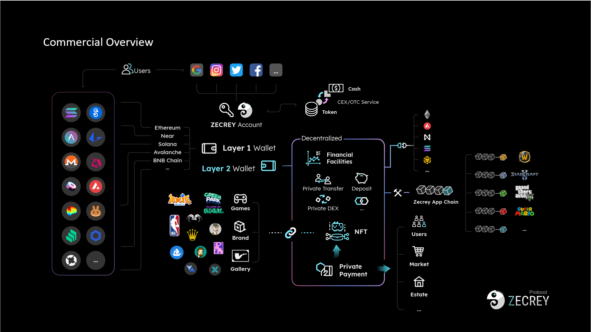

## About Kontos

Kontos is a zk-powered and AI-enhanced chain-abstraction infrastructure powered Zecrey Labs (https://zecrey.com/). Kontos especially focus on the following abstractions: account, asset, chain and action abstractions. Its superior architecture enables users to enjoy numerous features, including gas-less transactions, asset-less operations, and key-less with higher security. By offering a single account for multiple blockchains, Kontos simplifies the usability of blockchain-based applications and provides an easy entry point into the world of web3. It streamlines managing and trading assets across networks. It simplifies cross-chain transactions with innovative chain, account, asset, and action abstractions, revolutionizing multi-chain navigation. With these unique features, Kontos is revolutionizing the traditional blockchain ecosystem and paving the way for the decentralized future. We’re also backed by top investors: Binance Labs, Spartan Group, Shima Capital, Fenbushi Capital, .etc.
